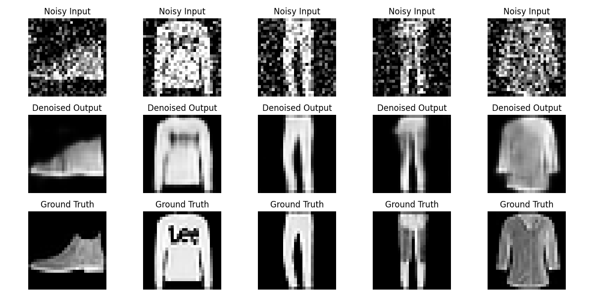

# Image Denoising using Convolutional Autoencoders (CAE)

**Author:** Lirisha Reddy 

**Framework:** TensorFlow / Keras  
**Domain:** Deep Learning & Computer Vision  

## 📌 Project Overview
This project implements a Deep Convolutional Autoencoder (CAE) trained to recover clean, high-fidelity images from severe synthetic Gaussian noise (\(\sigma = 0.3\)).

## 🏗️ Model Architecture
- **Input Layer:** \((28, 28, 1)\)
- **Encoder:** 
  - `Conv2D(32, (3,3))` + ReLU -> `MaxPooling2D((2,2))`
  - `Conv2D(16, (3,3))` + ReLU -> `MaxPooling2D((2,2))`
- **Bottleneck:** Compressed structural feature representations.
- **Decoder:**
  - `Conv2D(16, (3,3))` + ReLU -> `UpSampling2D((2,2))`
  - `Conv2D(32, (3,3))` + ReLU -> `UpSampling2D((2,2))`
  - `Conv2D(1, (3,3))` + Sigmoid output.

## 📊 Quantitative Benchmark Results
| Metric | Noisy Image | Denoised Reconstruction | Performance Gain |
| :--- | :---: | :---: | :---: |
| **Peak Signal-to-Noise Ratio (PSNR)** | 12.81 dB | **20.18 dB** | **+7.37 dB** |
| **Structural Similarity (SSIM)** | 0.4121 | **0.6888** | **+0.2767** |

## 🖼️ Dataset Results Evaluation

## 🚀 How to Run
1. Clone this repository.
2. Open `Image_Denoising_CAE.ipynb` in Google Colab or Jupyter Notebook.
3. Run all cells to train or perform evaluation using `autoencoder_fashion.h5`.
